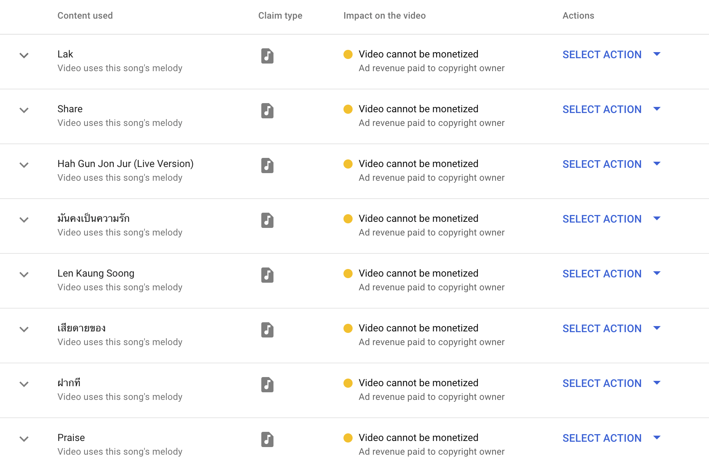
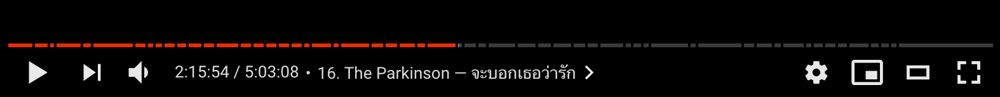

# Convert YouTube copyright claims to video descriptions

For music rehearsal session live streams, this script helps making the session recording easier to seek. Using received copyright claims, this script generates a video description that contains timestamps to each song.

### turns this

### into this

### by doing this

1. Open Chrome DevTools’ Network inspector, and look for an API call to `list_creator_received_claims`.

2. Copy the contents and paste it into a file.

3. `ruby generate.rb data.json`
